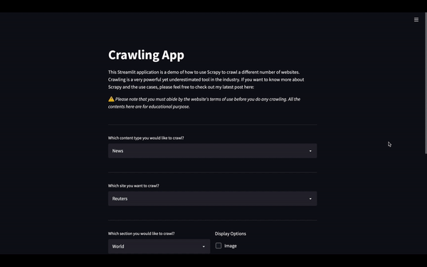

# News Article Scraper Demo
This is a demo to show you how to scrape a news article website using Scrapy.


## Medium Post
You can read my latest Medium to understand Scrapy and why it is useful for your next project, this is the link:

## Streamlit Sharing
I have already deployed the application on the Streamlit Sharing. You don't need to build the application locally. Just head over to [here](https://share.streamlit.io/coderdoufu/article_scraper/main/main.py) to start playing with the app!

## Installation
Create a virtual environment using [conda](https://docs.conda.io/en/latest/) and install the libraries:

```bash
conda create --name scrapydemo python=3.9
conda activate scrapydemo
pip install -r requirements.txt
```

## Usage

```bash
cd article_scraper
streamlit run main.py
```

It should automatically open up your browser and you should be able to see your application immediately. If not, go to your browser and type http://localhost:8501

## License
[MIT](https://choosealicense.com/licenses/mit/)
